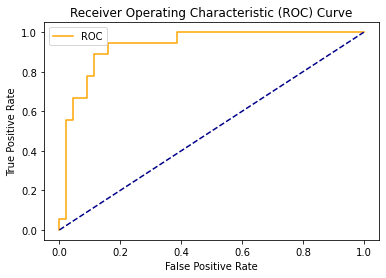

# Onderzoeksrapport PI7 Data Science

## Inleiding
Voor de minor Data Science pi7 zijn 6 opdrachten gemaakt verdeelt in 3 fases. 
1. Fase 1: Multiple regression en Logistic regression
2. Fase 2: Random Forests en Neurale netwerken 
3. Fase 3: Support vector machines en Bayesian networks

### Dataset Beschrijving attributen en target
Voor de verschillende opdrachten in de drie fases, is gekozon om onderstaande dataset toe te passen. De dataset, "Dataset Carprices", is een set aan data die bestaat uit 26 attributen die iets zeggen over 205 type auto's.

|  1 |           Car_ID          |                                                 Unique id of each   observation (Interger)                                                |
|:--:|:-------------------------:|:-----------------------------------------------------------------------------------------------------------------------------------------:|
|  2 |         Symboling         | Its assigned insurance risk   rating, A value of +3 indicates that the auto is risky, -3 that it is   probably pretty safe.(Categorical)  |
|  3 |         carCompany        |                                                    Name of car company   (Categorical)                                                    |
|  4 |          fueltype         |                                              Car fuel type i.e gas or   diesel (Categorical)                                              |
|  5 |         aspiration        |                                                  Aspiration used in a car   (Categorical)                                                 |
|  6 |         doornumber        |                                                  Number of doors in a car   (Categorical)                                                 |
|  7 |          carbody          |                                                         body of car (Categorical)                                                         |
|  8 |         drivewheel        |                                                    type of drive wheel   (Categorical)                                                    |
|  9 |       enginelocation      |                                                   Location of car engine   (Categorical)                                                  |
| 10 |         wheelbase         |                                                         Weelbase of car (Numeric)                                                         |
| 11 |         carlength         |                                                          Length of car (Numeric)                                                          |
| 12 |          carwidth         |                                                           Width of car (Numeric)                                                          |
| 13 |         carheight         |                                                          height of car (Numeric)                                                          |
| 14 |         curbweight        |                                        The weight of a car without occupants or baggage. (Numeric)                                        |
| 15 |         enginetype        |                                                      Type of engine.   (Categorical)                                                      |
| 16 |       cylindernumber      |                                                 cylinder placed in the car   (Categorical)                                                |
| 17 |         enginesize        |                                                           Size of car (Numeric)                                                           |
| 18 |         fuelsystem        |                                                     Fuel system of car   (Categorical)                                                    |
| 19 |         boreratio         |                                                         Boreratio of car (Numeric)                                                        |
| 20 |           stroke          |                                               Stroke or volume inside the   engine (Numeric)                                              |
| 21 |      compressionratio     |                                                    compression ratio of car   (Numeric)                                                   |
| 22 |         horsepower        |                                                            Horsepower (Numeric)                                                           |
| 23 |          peakrpm          |                                                           car peak rpm (Numeric)                                                          |
| 24 |          citympg          |                                                         Mileage in city (Numeric)                                                         |
| 25 |         highwaympg        |                                                       Mileage on highway   (Numeric)                                                      |
| 26 | price(Target variable)    |                                                           Price of car (Numeric)                                                          |

|  symboling |  wheelbase  |  carlength  | carwidth   | carheight        | \            |
|:----------:|:-----------:|:-----------:|------------|------------------|--------------|
|    count   |  205.000000 |  205.000000 | 205.000000 | 205.000000       | 205.000000   |
|    mean    |   0.834146  |  98.756585  | 174.049268 | 65.907805        | 53.724878    |
|     std    |   1.245307  |   6.021776  | 12.337289  | 2.145204         | 2.443522     |
|     min    |  -2.000000  |  86.600000  | 141.100000 | 60.300000        | 47.800000    |
|     25%    |   0.000000  |  94.500000  | 166.300000 | 64.100000        | 52.000000    |
|     50%    |   1.000000  |  97.000000  | 173.200000 | 65.500000        | 54.100000    |
|     75%    |   2.000000  |  102.400000 | 183.100000 | 66.900000        | 55.500000    |
|     max    |   3.000000  |  120.900000 | 208.100000 | 72.300000        | 59.800000    |
| curbweight |  enginesize |  boreratio  | stroke     | compressionratio | \            |

| curbweight | enginesize  | boreratio   | stroke     | compressionratio | \            |
|------------|-------------|-------------|------------|------------------|--------------|
|    count   |  205.000000 |  205.000000 | 205.000000 | 205.000000       | 205.000000   |
|    mean    | 2555.565854 |  126.907317 | 3.329756   | 3.255415         | 10.142537    |
|     std    |  520.680204 |  41.642693  | 0.270844   | 0.313597         | 3.972040     |
|     min    | 1488.000000 |  61.000000  | 2.540000   | 2.070000         | 7.000000     |
|     25%    | 2145.000000 |  97.000000  | 3.150000   | 3.110000         | 8.600000     |
|     50%    | 2414.000000 |  120.000000 | 3.310000   | 3.290000         | 9.000000     |
|     75%    | 2935.000000 |  141.000000 | 3.580000   | 3.410000         | 9.400000     |
|     max    | 4066.000000 |  326.000000 | 3.940000   | 4.170000         | 23.000000    |

| horsepower |   peakrpm   |   citympg   | highwaympg | price            |              |
|:----------:|:-----------:|:-----------:|------------|------------------|--------------|
|    count   |  205.000000 |  205.000000 | 205.000000 | 205.000000       | 205.000000   |
|    mean    |  104.117073 | 5125.121951 | 25.219512  | 30.751220        | 13276.710571 |
|     std    |  39.544167  |  476.985643 | 6.542142   | 6.886443         | 7988.852332  |
|     min    |  48.000000  | 4150.000000 | 13.000000  | 16.000000        | 5118.000000  |
|     25%    |  70.000000  | 4800.000000 | 19.000000  | 25.000000        | 7788.000000  |
|     50%    |  95.000000  | 5200.000000 | 24.000000  | 30.000000        | 10295.000000 |
|     75%    |  116.000000 | 5500.000000 | 30.000000  | 34.000000        | 16503.000000 |
| max        | 288.000000  | 6600.000000 | 49.000000  | 54.000000        | 45400.000000 |

#### Data preperatie
##### Heatmap analyse
Voordat begonnen is aan normalisatie en standaardisatie is gekeken of dit daadwerkelijk nodig was. Er is begonnen door eerst een heatmap te genereren om te kijken of er waardes zijn met een hoge correlatie, zodat deze eruit gefilterd kunnen worden om een bias te voorkomen. Zie de heatmap. Te zien is hoe "highwaympg" en "citympg" een correlatie hebben van 0.97. In het model laten we deze dan ook weg.

##### Standaardisatie
Als tweede stap is gekeken naar standaardisatie, zijn er kolommen die aangepast moeten worden om tot een beter resultaat te komen? Alle kolommen die geen nummerieke waarden bevatten zijn omgezet naar tabellen die wel nummerieke waarde bevatten, doormiddel van de "get_dummies()" functie van Pandas. Echter is een kolom, "CarName", niet efficiënt om op deze manier te standaardiseren. De kolom "CarName" heeft 205 waardes die bestaan uit unieke auto merken en types. Als deze kolom gestandaardiseerd word, resulteert dit in 205 nieuwe kolommen met 204 nullen en één 1. Dit leidde in de versie 1, tot een lage r2 score en een hoge rmse bij een test set van 30 procent. Om de kolom "CarName" te verbeteren is er gekozen om alle merken te categoriseren, zodoende werden alle type auto's van hetzelfde merk onder één naam gezet.

##### Normalisatie
Als derde stap is gekeken of normalisatie nodig zou zijn. In eerste instantie waren er geen kolommen die uitschietende waardes hadden. Alleen de target kolom had hoge waardes omdat er prijzen gehanteerd worden, maar aangezien dit de target kolom was zou zijn bij multiple linear regression zou deze sowieso niet meegenomen worden in de normalisatie. Om toch te kijken of normalisatie een positief effect zou hebben, in het geval dat er een andere target kolom gehanteerd zou worden, is deze toegepast. Echter waren de waardes na normalisatie zo abnormaal dat normalisatie niet is toegepast.

| Na Normalisatie bij multiple linear regression |                         |
|------------------------------------------------|-------------------------|
| rmse:                                          | 30267727458.953026      |
| r2:                                            | -2.7177251408947733e+22 |

## Fase 1
### Multiple linear regression
Bij deze opdracht is de te voorspellen waarde "price". Dit is de prijs van een type auto.

#### Code
~~~
# -*- coding: utf-8 -*-
"""
Created on Tue Dec 15 17:02:10 2020

@author: Rutger
"""
import pandas as pd
import numpy as np
import matplotlib.pyplot as plt
from sklearn.model_selection import train_test_split
from sklearn.linear_model import LinearRegression
from sklearn.metrics import mean_squared_error
from sklearn.metrics import r2_score
import seaborn as sns
import math

df = pd.read_csv('Dataset Carprices.csv')
df.head()
df = df.drop(['car_ID', 'highwaympg', 'citympg'], 1)

#Heatmap
#sns.set(rc={'figure.figsize':(11.7,8.27)})
#sns.heatmap(df.corr().round(2),square=True,cmap="RdYlGn",annot=True)

#Preperatie op CarName
i =0
while i < len(df.CarName):
    df.CarName[i] = df.CarName[i].split()[0]
    i += 1
    
pd.set_option('display.max_columns', 200)
print(df.describe())

#Dataset standaardiseren
df = pd.get_dummies(df, columns=['CarName','fueltype','aspiration','doornumber','carbody',
                                 'drivewheel','enginelocation','enginetype','cylindernumber',
                                 'fuelsystem'], prefix="", prefix_sep="")

print(df.info())

#Normalisatie (n.v.t.)
#df = (df-df.min())/(df.max()-df.min())
      
y = df.price
x = df.drop('price', 1)

x_train, x_test, y_train, y_test = train_test_split(x,y, test_size=0.3 ,random_state=7)

lg = LinearRegression()

lg.fit(x_train, y_train)

y_pred = lg.predict(x_test)

mse = mean_squared_error(y_test, y_pred)
rtwo = r2_score(y_test, y_pred)
print('\nrmse: ',math.sqrt(mse), '\nr2: ', rtwo)

plt.scatter(y_test, y_pred)
    
z = np.polyfit(y_test, y_pred, 1)
p = np.poly1d(z)
plt.plot(y_test,p(y_test),"r--")

plt.show()
~~~

#### Output
- Random_state: 7
- Data test set: 30 procent
- Data train set: 70 procent

- rmse:  3041.884027168188 
- r2:  0.8308355282333387

#### Conclusie
Het uiteindelijke resultaat laat zien dat er een rmse is van ongeveer 3000 euro met r2 score van ongeveer 83 procent. Dit laat zien dat er een goed verband is tussen alle attributen en dat er een vrij goede voorspelling gedaan kan worden over de dataset.

#### Feedback
In de feedback momenten, werd er vooral aangekaart dat we meer aandacht moesten bieden aan het voorbereiden van de data. De geschreven code was prima, maar er moest meer gefocussed worden op het analyseren van de verbanden in de dataset om te kijken hoe de uitkomst het beste zou worden.
Zo is er aangeraden om de kolom "CarName" op te splitsen in merknamen i.p.v. type auto's. Ook werd als tip gegeven om aan de hand van de heatmap te kijken welke attributen een goede correlatie hadden en dus een biassed uitkomst konden leveren.

### Logistic regression
Hier moet nog een toelichting komen

#### Code
~~~~
# -*- coding: utf-8 -*-
"""
Created on Tue Dec 29 16:38:30 2020

@author: rdegr
"""

import pandas as pd
import numpy as np
from sklearn.linear_model import LogisticRegression
from sklearn.model_selection import train_test_split
from sklearn.metrics import classification_report, confusion_matrix, accuracy_score
import matplotlib.pyplot as plt
from sklearn.metrics import roc_curve
from sklearn.metrics import roc_auc_score

def plot_roc_curve(fpr, tpr):
    plt.plot(fpr, tpr, color='orange', label='ROC')
    plt.plot([0, 1], [0, 1], color='darkblue', linestyle='--')
    plt.xlabel('False Positive Rate')
    plt.ylabel('True Positive Rate')
    plt.title('Receiver Operating Characteristic (ROC) Curve')
    plt.legend()
    plt.show()

df = pd.read_csv('Dataset Carprices.csv')
df.head()
df = df.drop(['car_ID', 'highwaympg', 'citympg'], 1)

targetkolom = 'price'

#Preperatie op CarName
i =0
while i < len(df.CarName):
    df.CarName[i] = df.CarName[i].split()[0]
    i += 1
    
pd.set_option('display.max_columns', 200)
#print(df.describe())

#Dataset standaardiseren
df = pd.get_dummies(df, columns=['CarName','fueltype','aspiration','doornumber','carbody',
                                 'drivewheel','enginelocation','enginetype','cylindernumber',
                                 'fuelsystem'], prefix="", prefix_sep="")

ToBinairize = ['price']# alleen target binairizen

q =0
while q < len(ToBinairize):
    bins = (int(min(df[ToBinairize[q]])-1), int(np.mean(df[ToBinairize[q]])), int(max(df[ToBinairize[q]])+1))
    group_names = [0, 1]
    df[ToBinairize[q]] = pd.cut(df[ToBinairize[q]], bins = bins, labels=group_names)
    q+=1

#print(df.info())
      
y = df[targetkolom]
x = df.drop(targetkolom, 1)

#Normalisatie (n.v.t.)
x = (x-x.min())/(x.max()-x.min())

x_train, x_test, y_train, y_test = train_test_split(x,y, test_size=0.3 ,random_state=7)

model = LogisticRegression(max_iter=662)

model.fit(x_train, y_train)

y_pred = model.predict(x_test)

probs = model.predict_proba(x_test)

probs = probs[:, 1]

auc = roc_auc_score(y_test, probs)

print('AUC: %.2f' % auc)

fpr, tpr, thresholds = roc_curve(y_test, probs)

plot_roc_curve(fpr, tpr)

print("Confusion matrix:\n", confusion_matrix(y_test,y_pred))
print("Classification Report:\n",classification_report(y_test,y_pred))
print("Accuracy score:\n",accuracy_score(y_test, y_pred))
~~~~

#### Output
- Random_state: 7
- Data test set: 30 procent
- Data train set: 70 procent

AUC score: 
0.95

Confusion matrix:
|              | Predicted True | Predicted False |
|--------------|----------------|-----------------|
| Actual True  |       41       |        3        |
| Actual False |        4       |        14       |

Classification Report:
|              | precision | recall | f1-score | support |
|--------------|-----------|--------|----------|---------|
| 0            |    0.91   |  0.93  | 0.92     | 44      |
| 1            |    0.82   |  0.78  | 0.80     | 18      |
| accuracy     |           |        | 0.89     | 62      |
| macro avg    | 0.87      | 0.85   | 0.86     | 62      |
| weighted avg | 0.89      | 0.89   | 0.89     | 62      |

Accuracy score:
0.8870967741935484
 
ROC curve:

#### Conclusie
Het uiteindelijke resultaat laat zien dat er een rmse is van ongeveer 0.25 met r2 score van ongeveer 13 procent. Dit laat zien dat er geen goed verband is tussen alle attributen en dat er een niet echt een goede voorspelling gedaan worden over de kans dat op basis van de data het ype auto een Nissan is.
- AANPASSEN

#### Feedback
volgensmij was er feedback gegeven over de visualisatie. helaas ben ik dit vergeten. bij het volgende moment even vragen.
- roc curve miste

## Fase 2
### Random forests 
Toelichting met keuze voor target als volkswagen

toelichting waarom is gekozen voor 30 bomen ipv een ander aantal.
Zoals te zien hier onder, is geanalyseerd welke hoeveelheid aan desicion trees benodigd zou zijn voor de beste score. 1000 en 10000 decision trees hebben uiteindelijk de beste score. 1000 trees zal worden gehanteerd binnen de code omdat daarvan de compile tijd korter zal zijn. Interessant om te zien is dat bij een random forest van 100000 trees de score weer lager wordt, dit heeft waarschijnlijk te maken met overfitting.

- 20 trees:   0.8548387096774194
- 30 trees:   0.8548387096774194
- 50 trees:   0.8548387096774194
- 100 trees:   0.8548387096774194
- 1000 trees:   0.8709677419354839
- 10000 trees:  0.8709677419354839
- 100000 trees:  0.8548387096774194

#### Code
~~~~
# -*- coding: utf-8 -*-
"""
Created on Tue Dec 29 16:38:30 2020

@author: rdegr
"""

import pandas as pd
import numpy as np
from sklearn.model_selection import train_test_split
from sklearn.metrics import classification_report, confusion_matrix, accuracy_score
import matplotlib.pyplot as plt
from sklearn.ensemble import RandomForestClassifier
from sklearn.metrics import roc_curve
from sklearn.metrics import roc_auc_score

def plot_roc_curve(fpr, tpr):
    plt.plot(fpr, tpr, color='orange', label='ROC')
    plt.plot([0, 1], [0, 1], color='darkblue', linestyle='--')
    plt.xlabel('False Positive Rate')
    plt.ylabel('True Positive Rate')
    plt.title('Receiver Operating Characteristic (ROC) Curve')
    plt.legend()
    plt.show()

df = pd.read_csv('Dataset Carprices.csv')
df.head()
df = df.drop(['car_ID', 'highwaympg', 'citympg'], 1)

targetkolom = 'price'

#Preperatie op CarName
i =0
while i < len(df.CarName):
    df.CarName[i] = df.CarName[i].split()[0]
    i += 1
    
pd.set_option('display.max_columns', 200)
#print(df.describe())

#Dataset standaardiseren
df = pd.get_dummies(df, columns=['CarName','fueltype','aspiration','doornumber','carbody',
                                 'drivewheel','enginelocation','enginetype','cylindernumber',
                                 'fuelsystem'], prefix="", prefix_sep="")

ToBinairize = ['price']

q =0
while q < len(ToBinairize):
    bins = (int(min(df[ToBinairize[q]])-1), int(np.mean(df[ToBinairize[q]])), int(max(df[ToBinairize[q]])+1))
    group_names = [0, 1]
    df[ToBinairize[q]] = pd.cut(df[ToBinairize[q]], bins = bins, labels=group_names)
    q+=1

#print(df.info())
      
y = df[targetkolom]
x = df.drop(targetkolom, 1)

#Normalisatie (n.v.t.)
x = (x-x.min())/(x.max()-x.min())

x_train, x_test, y_train, y_test = train_test_split(x,y, test_size=0.3 ,random_state=7)

model = RandomForestClassifier(n_estimators=1000, random_state=1)

model.fit(x_train, y_train)

y_pred = model.predict(x_test)

probs = model.predict_proba(x_test)

probs = probs[:, 1]

auc = roc_auc_score(y_test, probs)

print('AUC: %.2f' % auc)

fpr, tpr, thresholds = roc_curve(y_test, probs)

plot_roc_curve(fpr, tpr)

print("Confusion matrix:\n", confusion_matrix(y_test,y_pred))
print("Classification Report:\n",classification_report(y_test,y_pred))
print("Accuracy score:\n",accuracy_score(y_test, y_pred))
~~~~

#### Output
AUC score:
0.93

Confusion matrix:
|              | Predicted True | Predicted False |
|--------------|----------------|-----------------|
| Actual True  |       40       |        4        |
| Actual False |        4       |        14       |

Classification Report:
|              | precision | recall | f1-score | support |
|--------------|-----------|--------|----------|---------|
| 0            | 0.91      | 0.91   | 0.91     | 44      |
| 1            | 0.78      | 0.78   | 0.78     | 18       |
| accuracy     |           |        | 0.87     | 62      |
| macro avg    | 0.84      | 0.84   | 0.84     | 62      |
| weighted avg | 0.87      | 0.87   | 0.87     | 62      |

Accuracy score:
0.8709677419354839

ROC curve:

#### Conclusie
Het uiteindelijke resultaat laat zien dat er een accuracy is van ongeveer 93 procent bij een randomforest van 30 bomen. Dit houdt in dat het model op basis van de dataset de type auto Volkswagen met een zekerheid van 95 procent kan voorspellen. 

#### Feedback
- Wat voor visuals zijn hierbij van toepassing?
- alleen x normalizeren niet target en de non binairize exl dummiies en target
- alleen target binairizen

### Neurale netwerken 
Toeliching
#### Code

#### Output

#### Conclusie

#### Feedback

## Fase 3
### Support vector machines

### Bayesian networks

## Auteurs
- Rutger de Groen https://rutgerfrans.com/
- Maroche Delnoy https://www.linkedin.com/in/maroche-delnoy-788ab9195/

 

