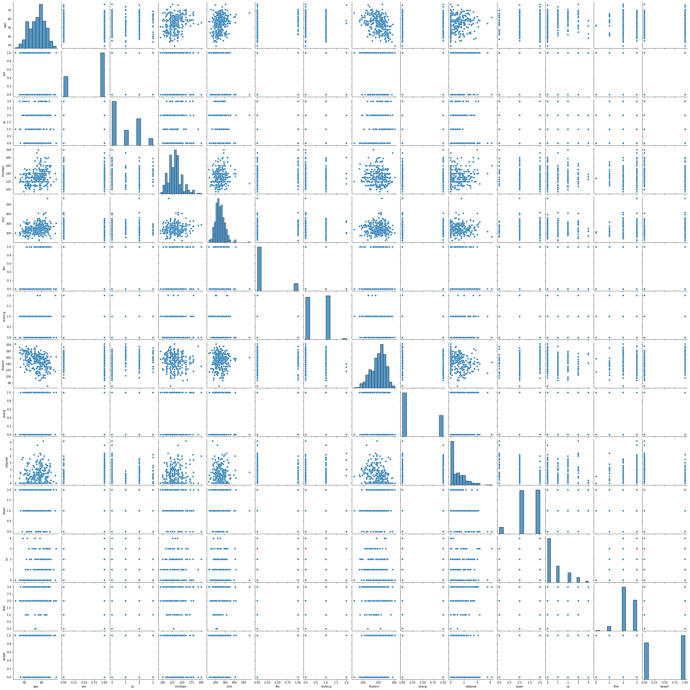

# Onderzoeksrapport PI7 Data Science

## Inleiding
Voor de minor Data Science pi7 zijn 6 opdrachten gemaakt verdeelt in 3 fases. 
1. Fase 1: Multiple regression en Logistic regression
2. Fase 2: Random Forests en Neurale netwerken 
3. Fase 3: Support vector machines en Bayesian networks

## Fase 1
### Multiple linear regression

#### Beschrijving

#### Data opzet
| car_ID | symboling | CarName                    | fueltype | aspiration | doornumber | carbody     | drivewheel | enginelocation | wheelbase | carlength | carwidth | carheight | curbweight | enginetype | cylindernumber | enginesize | fuelsystem | boreratio | stroke | compressionratio | horsepower | peakrpm | citympg | highwaympg | price |
|--------|-----------|----------------------------|----------|------------|------------|-------------|------------|----------------|-----------|-----------|----------|-----------|------------|------------|----------------|------------|------------|-----------|--------|------------------|------------|---------|---------|------------|-------|
| 1      | 3         | alfa-romero   giulia       | gas      | std        | two        | convertible | rwd        | front          | 886       | 1688      | 641      | 488       | 2548       | dohc       | four           | 130        | mpfi       | 347       | 268    | 9                | 111        | 5000    | 21      | 27         | 13495 |
| 2      | 3         | alfa-romero stelvio        | gas      | std        | two        | convertible | rwd        | front          | 886       | 1688      | 641      | 488       | 2548       | dohc       | four           | 130        | mpfi       | 347       | 268    | 9                | 111        | 5000    | 21      | 27         | 16500 |
| 3      | 1         | alfa-romero   Quadrifoglio | gas      | std        | two        | hatchback   | rwd        | front          | 945       | 1712      | 655      | 524       | 2823       | ohcv       | six            | 152        | mpfi       | 268       | 347    | 9                | 154        | 5000    | 19      | 26         | 16500 |
| 4      | 2         | audi 100 ls                | gas      | std        | four       | sedan       | fwd        | front          | 998       | 1766      | 662      | 543       | 2337       | ohc        | four           | 109        | mpfi       | 319       | 34     | 10               | 102        | 5500    | 24      | 30         | 13950 |
| 5      | 2         | audi 100ls                 | gas      | std        | four       | sedan       | 4wd        | front          | 994       | 1766      | 664      | 543       | 2824       | ohc        | five           | 136        | mpfi       | 319       | 34     | 8                | 115        | 5500    | 18      | 22         | 17450 |

#### Code
~~~
# -*- coding: utf-8 -*-
"""
Created on Tue Dec 15 17:02:10 2020

@author: Rutger
"""
import pandas as pd
import numpy as np
import matplotlib.pyplot as plt
from sklearn.model_selection import train_test_split
from sklearn.linear_model import LinearRegression
from sklearn.metrics import mean_squared_error
from sklearn.metrics import r2_score
from sklearn.preprocessing import normalize
import seaborn as sns
import math

df = pd.read_csv('Dataset Carprices.csv')
df.head()
df = df.drop('car_ID', 1)

df = pd.get_dummies(df, columns=['CarName','fueltype','aspiration','doornumber','carbody',
                                 'drivewheel','enginelocation','enginetype','cylindernumber',
                                 'fuelsystem'], prefix="", prefix_sep="")
       
y = df.price
x = df.drop('price', 1)

x_train, x_test, y_train, y_test = train_test_split(x,y,test_size=0.5,random_state=0)#wat is random state?

lg = LinearRegression()

lg.fit(x_train, y_train)

y_pred = lg.predict(x_test)

mse = mean_squared_error(y_test, y_pred)
rtwo = r2_score(y_test, y_pred)
print('\nrmse: ',math.sqrt(mse), '\nr2: ', rtwo)

plt.scatter(y_test, y_pred)
    
z = np.polyfit(y_test, y_pred, 1)
p = np.poly1d(z)
plt.plot(y_test,p(y_test),"r--")

plt.show()
~~~

#### Output

#### Conclusie

#### Feedback

### Logistic regression
Voor de opdracht van logistic regression is er een dataset toegepast over de kans op een hartaanval; https://www.kaggle.com/nareshbhat/health-care-data-set-on-heart-attack-possibility.
Deze dataset is gevonden op de website van kaggle, dit leek betrouwbaar aangezien het studieboek, Data Science Design Manual, deze bron vaker gebruikt om theorieën toe te lichten.

#### Beschrijving
Deze dataset bevat van ongeveer 300 patienten, 13 attributen die kunnen inschatten of een patient een mindere- of hogere kans heeft op een hartaanval. Deze dataset is passend omdat de kans op een hartaanval binair wordt gepresenteerd met een 1 of 0.

| Attribuut     | Toelichting                                                                     |
| ------------- |:-------------------------------------------------------------------------------:|
| age           | Leeftijd van patiënt                                                            |
| sex           | Geslacht van patiënt                                                            |
| cp            | Borstkast pijn (0 - 3)                                                          |
| trest bps     | Bloeddruk bij rust                                                              |
| chol          | serumcholestoraal in mg / dl                                                    |
| fbs           | Bloedsuiker nuchter > 120 mg / dl                                               |
| restecg       | Elektrocardiografische resultaten bij rust (0 - 2)                              |
| thalach       | Maximale hartslag bereikt                                                       |
| exang         | Oefening geïnduceerde angina                                                    |
| oldpeak       | Oldpeak = ST-depressie veroorzaakt door inspanning ten opzichte van rust        |    
| slope         | De helling van het ST-segment met piekoefening                                  |
| ca            | Aantal grote bloed vaten (0 - 3) gekleurd door flourosopie                      |
| thal          | Thalassemia: 0 = normaal; 1 = vast; 2 = omkeerbaar defect                       |
| target        | Target: 0 = minder kans op een hartaanval; 1 = meer kans op een hartaanval      |

#### Data opzet
| patient | age | sex | cp | trestbps | chol | fbs | restecg | thalach | exang | oldpeak | slope | ca | thal | target |
|---------|-----|-----|----|----------|------|-----|---------|---------|-------|---------|-------|----|------|--------|
| 1       | 63  | 1   | 3  | 145      | 233  | 1   | 0       | 150     | 0     | 23      | 0     | 0  | 1    | 1      |
| 2       | 37  | 1   | 2  | 130      | 250  | 0   | 1       | 187     | 0     | 35      | 0     | 0  | 2    | 1      |
| 3       | 41  | 0   | 1  | 130      | 204  | 0   | 0       | 172     | 0     | 14      | 2     | 0  | 2    | 1      |
| 4       | 56  | 1   | 1  | 120      | 236  | 0   | 1       | 178     | 0     | 8       | 2     | 0  | 2    | 1      |
| 5       | 57  | 0   | 0  | 120      | 354  | 0   | 1       | 163     | 1     | 6       | 2     | 0  | 2    | 1      |
|..       |..   |..   |..  |..        |..    |..   |..       |..       |..     |..       |..     |..  |..    |..      |

#### Code
~~~~
# -*- coding: utf-8 -*-
"""
Created on Sat Dec  5 14:16:21 2020

@author: Rutger
"""

import pandas as pd
import numpy as np
from sklearn.linear_model import LogisticRegression
import matplotlib.pyplot as plt
import seaborn as sns

df = pd.read_csv('Dataset Heart.csv')
df.head()

LogReg = LogisticRegression()

y = df['target']
x = df[['age','sex','cp','trestbps','chol','fbs','restecg','thalach','exang','oldpeak','slope','ca','thal']]

LogReg.fit(x, y)

y_pred = LogReg.predict(x)

score = LogReg.score(x, y)

i = 0
while i < len(y_pred):
    print('Person ', i, ': ', y_pred[i])
    i += 1

print('ROC score: ', score)

sns.pairplot(df)
~~~~

#### Output
##### Code  output
~~~~
Person  0 :  1
Person  1 :  1
Person  2 :  1
Person  3 :  1
Person  4 :  1
Person  5 :  1
..
ROC score:  0.8514851485148515
~~~~
##### Visualisatie output pairplot

#### Conclusie
Op basis van de 13 attributen uit de dataset heeft dit model met een ROC score van ongeveer 85 procent betrouwbaarheid een voorspelling kunnen maken op de kans van een hartaanval.

#### Feedback

## Fase 2
### Random forests

### Neurale netwerken 

## Fase 3
### Support vector machines

### Bayesian networks

## Auteurs
- Rutger de Groen https://rutgerfrans.com/
- Maroche Delnoy https://www.linkedin.com/in/maroche-delnoy-788ab9195/

 

