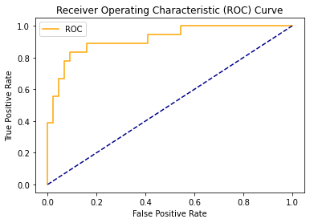
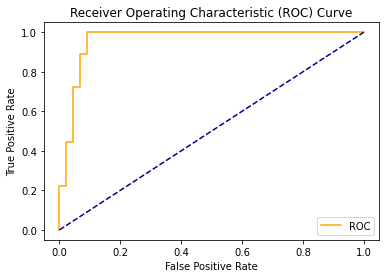

# Onderzoeksrapport PI7 Data Science

- [Inleiding](#Inleiding)
- [Data selectie](#Dataselectie)
    - [Data beschrijving](#Datasetbeschrijving)
    - [Data preperatie](#Datapreperatie)
- [Fase 1](#Fase1)
- [Multiple Linear Regression](#mlr)
- [Logistic Regression](#lr)
- [Fase 2](#Fase2)
- [Random Forests](#rf)
- [Neural Networks](#nn)
- [Fase 3](#Fase3)
- [Support Vector Machines](#svm)
- [Bayesian Networks](#bn)
- [Conclusie](#AlgeheleConclusie)
- [Auteurs](#Auteurs)

##  Inleiding
Voor de minor Data Science pi7 zijn 6 opdrachten gemaakt verdeelt in 3 fases. 
1. Fase 1: Multiple regression en Logistic regression
2. Fase 2: Random Forests en Neurale netwerken 
3. Fase 3: Support vector machines en Bayesian networks

###  Data selectie
####  Dataset Beschrijving attributen en target
Voor de verschillende opdrachten in de drie fases, is gekozen om onderstaande dataset toe te passen. De dataset, "Dataset Carprices", is een set aan data die bestaat uit 26 attributen die iets zeggen over 205 type auto's.

|  1 |           Car_ID          |                                                 Unique id of each   observation (Interger)                                                |
|:--:|:-------------------------:|:-----------------------------------------------------------------------------------------------------------------------------------------:|
|  2 |         Symboling         | Its assigned insurance risk   rating, A value of +3 indicates that the auto is risky, -3 that it is   probably pretty safe.(Categorical)  |
|  3 |         carCompany        |                                                    Name of car company   (Categorical)                                                    |
|  4 |          fueltype         |                                              Car fuel type i.e gas or   diesel (Categorical)                                              |
|  5 |         aspiration        |                                                  Aspiration used in a car   (Categorical)                                                 |
|  6 |         doornumber        |                                                  Number of doors in a car   (Categorical)                                                 |
|  7 |          carbody          |                                                         body of car (Categorical)                                                         |
|  8 |         drivewheel        |                                                    type of drive wheel   (Categorical)                                                    |
|  9 |       enginelocation      |                                                   Location of car engine   (Categorical)                                                  |
| 10 |         wheelbase         |                                                         Weelbase of car (Numeric)                                                         |
| 11 |         carlength         |                                                          Length of car (Numeric)                                                          |
| 12 |          carwidth         |                                                           Width of car (Numeric)                                                          |
| 13 |         carheight         |                                                          height of car (Numeric)                                                          |
| 14 |         curbweight        |                                        The weight of a car without occupants or baggage. (Numeric)                                        |
| 15 |         enginetype        |                                                      Type of engine.   (Categorical)                                                      |
| 16 |       cylindernumber      |                                                 cylinder placed in the car   (Categorical)                                                |
| 17 |         enginesize        |                                                           Size of car (Numeric)                                                           |
| 18 |         fuelsystem        |                                                     Fuel system of car   (Categorical)                                                    |
| 19 |         boreratio         |                                                         Boreratio of car (Numeric)                                                        |
| 20 |           stroke          |                                               Stroke or volume inside the   engine (Numeric)                                              |
| 21 |      compressionratio     |                                                    compression ratio of car   (Numeric)                                                   |
| 22 |         horsepower        |                                                            Horsepower (Numeric)                                                           |
| 23 |          peakrpm          |                                                           car peak rpm (Numeric)                                                          |
| 24 |          citympg          |                                                         Mileage in city (Numeric)                                                         |
| 25 |         highwaympg        |                                                       Mileage on highway   (Numeric)                                                      |
| 26 | price(Target variable)    |                                                           Price of car (Numeric)                                                          |

| feature          | count    | mean         | std         | min     | 25%     | 50%      | 75%          | max         |
|------------------|----------|--------------|-------------|---------|---------|----------|--------------|-------------|
| symboling        | 205.0    | 0.834146     | 1.245307    | -2.00   | 0.00    | 1.00     | 2.00         | 3.00        |
| wheelbase        | 205.0    | 98.756585    | 6.021776    | 86.60   | 94.50   | 97.00    | 102.40       | 120.90      |
| carlength        | 205.0    | 174.049268   | 12.337289   | 141.10  | 166.30  | 173.20   | 183.10       | 208.10      |
| carwidth         | 205.0    | 65.907805    | 2.145204    | 60.30   | 64.10   | 65.50    | 66.90        | 72.30       |
| carheight        | 205.0    | 53.724878    | 2.443522    | 47.80   | 52.00   | 54.10    | 55.50        | 59.80       |
| curbweight       | 205.0    | 2555.565854  | 520.680204  | 1488.00 | 2145.00 | 2414.00  | 2935.00      | 4066.00     |
| enginesize       | 205.0    | 126.907317   | 41.642693   | 61.00   | 97.00   | 120.00   | 141.00       | 326.00      |
| boreratio        | 205.0    | 3.329756     | 0.270844    | 2.54    | 3.15    | 3.31     | 3.58         | 3.94        |
| stroke           | 205.0    | 3.255415     | 0.313597    | 2.07    | 3.11    | 3.29     | 3.41         | 4.17        |
| compressionratio | 205.0    | 10.142537    | 3.972040    | 7.00    | 8.60    | 9.00     | 9.40         | 23.00       |
| horsepower       | 205.0    | 104.117073   | 39.544167   | 48.00   | 70.00   | 95.00    | 116.00       | 288.00      |
| peakrpm          | 205.0    | 5125.121951  | 476.985643  | 4150.00 | 4800.00 | 5200.00  | 5500.00      | 6600.00     |
| price            | 205.0    | 13276.710571 | 7988.852332 | 5118.00 | 7788.00 | 10295.00 | 16503.00     | 45400.00    |

####  Data preperatie
##### Heatmap analyse
Voordat begonnen is aan normalisatie en standaardisatie is gekeken of dit daadwerkelijk nodig was. Er is begonnen door eerst een heatmap te genereren om te kijken of er waardes zijn met een hoge correlatie, zodat deze eruit gefilterd kunnen worden om een bias te voorkomen. Zie de heatmap. Te zien is hoe "highwaympg" en "citympg" een correlatie hebben van 0.97. In het model laten we deze dan ook weg.

##### Standaardiseren
Als tweede stap is gekeken naar standaardisatie, zijn er kolommen die aangepast moeten worden om tot een beter resultaat te komen? Alle kolommen die geen nummerieke waarden bevatten zijn omgezet naar tabellen die wel nummerieke waarde bevatten, doormiddel van de "get_dummies()" functie van Pandas. Echter is een kolom, "CarName", niet efficiënt om op deze manier te standaardiseren. De kolom "CarName" heeft 205 waardes die bestaan uit unieke auto merken en types. Als deze kolom gestandaardiseerd word, resulteert dit in 205 nieuwe kolommen met 204 nullen en één 1. Dit leidde in de versie 1, tot een lage r2 score en een hoge rmse bij een test set van 30 procent. Om de kolom "CarName" te verbeteren is er gekozen om alle merken te categoriseren, zodoende werden alle type auto's van hetzelfde merk onder één naam gezet.

##### Normalisatie
Als derde stap is gekeken of normalisatie nodig zou zijn. In eerste instantie waren er geen kolommen die uitschietende waardes hadden. Alleen de target kolom had hoge waardes omdat er prijzen gehanteerd worden, maar aangezien dit de target kolom was zou zijn bij multiple linear regression zou deze sowieso niet meegenomen worden in de normalisatie. Om toch te kijken of normalisatie een positief effect zou hebben, in het geval dat er een andere target kolom gehanteerd zou worden, is deze toegepast. Echter waren de waardes na normalisatie zo abnormaal dat normalisatie niet is toegepast.

| Na Normalisatie bij multiple linear regression |                         |
|------------------------------------------------|-------------------------|
| rmse:                                          | 30267727458.953026      |
| r2:                                            | -2.7177251408947733e+22 |

Hier toelichten dat dit per model anders is!!!!!!!!!!!!!!!!!!!!!!!!!!!!!!!!!!!!!!!!!!!

##  Fase 1
###  Multiple linear regression
Multiple linear regression is een machine learning model die binnen supervised learning wordt toegepast. Dit model zoekt zoekt een relatie tussen afhankelijke en een of meer onafhankelijke variabelen door de best passende rechte lijn te plaatsen. In deze toepassing zoekt het model in de dataset "Carprices" een lineair verband tussen de afhankelijke variabele, carprice, en de overige features die zijn over gebleven na de data preperatie.

#### Code
~~~
# -*- coding: utf-8 -*-
"""
Created on Tue Dec 15 17:02:10 2020

@author: Rutger
"""
import pandas as pd
import numpy as np
import matplotlib.pyplot as plt
from sklearn.model_selection import train_test_split
from sklearn.linear_model import LinearRegression
from sklearn.metrics import mean_squared_error
from sklearn.metrics import r2_score
import seaborn as sns
import math

df = pd.read_csv('Dataset Carprices.csv')
df.head()
df = df.drop(['car_ID', 'highwaympg', 'citympg'], 1)

#Heatmap
#sns.set(rc={'figure.figsize':(11.7,8.27)})
#sns.heatmap(df.corr().round(2),square=True,cmap="RdYlGn",annot=True)

#Preperatie op CarName
i =0
while i < len(df.CarName):
    df.CarName[i] = df.CarName[i].split()[0]
    i += 1
    
pd.set_option('display.max_columns', 200)
print(df.describe())

#Dataset standaardiseren
df = pd.get_dummies(df, columns=['CarName','fueltype','aspiration','doornumber','carbody',
                                 'drivewheel','enginelocation','enginetype','cylindernumber',
                                 'fuelsystem'], prefix="", prefix_sep="")

print(df.info())
      
y = df.price
x = df.drop('price', 1)

#Normalisatie (n.v.t.)
#x = (x-x.min())/(x.max()-x.min())

x_train, x_test, y_train, y_test = train_test_split(x,y, test_size=0.3 ,random_state=7)

lg = LinearRegression()

lg.fit(x_train, y_train)

y_pred = lg.predict(x_test)

mse = mean_squared_error(y_test, y_pred)
rtwo = r2_score(y_test, y_pred)
print('\nrmse: ',math.sqrt(mse), '\nr2: ', rtwo)

plt.scatter(y_test, y_pred)
    
z = np.polyfit(y_test, y_pred, 1)
p = np.poly1d(z)
plt.plot(y_test,p(y_test),"r--")

plt.show()
~~~

#### Output
- rmse:  3041.884027168188 
- r2:  0.8308355282333387

#### Conclusie
Het uiteindelijke resultaat laat zien dat er een rmse is van ongeveer 3000 euro met r2 score van ongeveer 83 procent. Dit laat zien dat er een vrij goed lineair verband is tussen "Carprice" en alle andere features. Er kan dus met ongeveer 83 procent zekerheid worden voorspeld wat de prijs van een auto zal zijn op basis van deze dataset. De rmse ziet er ook vrij normaal uit aangezien de gemiddelde prijs van een auto rond de 13000 euro ligt. Een rmse van 3000 euro ziet er daarom niet gek uit. Tevens is er ook een logisch verband te zien in de plot waarbij de voorspeelde target tegenover de daadwerkelijk target is gezet.

#### Feedback
In de feedback momenten, werd er vooral aangekaart dat we meer aandacht moesten bieden aan het voorbereiden van de data. De geschreven code was prima, maar er moest meer gefocust worden op het analyseren van de verbanden in de dataset om te kijken hoe de resultaat het beste zou worden.
Zo is er aangeraden om de kolom "CarName" op te splitsen in merknamen i.p.v. type auto's. Ook werd als tip gegeven om aan de hand van de heatmap te kijken welke attributen een goede correlatie hadden en dus een biassed uitkomst konden leveren.

###  Logistic regression
Logistic regression is een machine learning model die binnen supervised learning wordt toegepast voor classificatie. In de statistiek wordt logistische regressie gebruikt om een geclassificeerde uitkomstvariabele te relateren aan een of meer variabelen. Hierbij is de geclassificeerde uitkomstvariabele dichotoom. In dit model wordt wederom de prijs van de auto als target variabele gebruikt. In dit geval is het belangrijk dat deze variabele omgezet wordt naar een binaire vorm, zo zijn de prijzen opgedeeld in hoog of laag. Afhankelijk van het gemiddelde is bepaald of de prijs van een auto laag of hoog is.

#### Code
~~~~
# -*- coding: utf-8 -*-
"""
Created on Tue Dec 29 16:38:30 2020

@author: rdegr
"""

import pandas as pd
import numpy as np
from sklearn.linear_model import LogisticRegression
from sklearn.model_selection import train_test_split
from sklearn.metrics import classification_report, confusion_matrix, accuracy_score
import matplotlib.pyplot as plt
from sklearn.metrics import roc_curve
from sklearn.metrics import roc_auc_score

def plot_roc_curve(fpr, tpr):
    plt.plot(fpr, tpr, color='orange', label='ROC')
    plt.plot([0, 1], [0, 1], color='darkblue', linestyle='--')
    plt.xlabel('False Positive Rate')
    plt.ylabel('True Positive Rate')
    plt.title('Receiver Operating Characteristic (ROC) Curve')
    plt.legend()
    plt.show()

df = pd.read_csv('Dataset Carprices.csv')
df.head()
df = df.drop(['car_ID', 'highwaympg', 'citympg'], 1)

targetkolom = 'price'

#Preperatie op CarName
i =0
while i < len(df.CarName):
    df.CarName[i] = df.CarName[i].split()[0]
    i += 1
    
pd.set_option('display.max_columns', 200)
#print(df.describe())

#Dataset standaardiseren
df = pd.get_dummies(df, columns=['CarName','fueltype','aspiration','doornumber','carbody',
                                 'drivewheel','enginelocation','enginetype','cylindernumber',
                                 'fuelsystem'], prefix="", prefix_sep="")

ToBinairize = ['price']# alleen target binairizen

q =0
while q < len(ToBinairize):
    bins = (int(min(df[ToBinairize[q]])-1), int(np.mean(df[ToBinairize[q]])), int(max(df[ToBinairize[q]])+1))
    group_names = [0, 1]
    df[ToBinairize[q]] = pd.cut(df[ToBinairize[q]], bins = bins, labels=group_names)
    q+=1

#print(df.info())
      
y = df[targetkolom]
x = df.drop(targetkolom, 1)

#Normalisatie (n.v.t.)
x = (x-x.min())/(x.max()-x.min())

x_train, x_test, y_train, y_test = train_test_split(x,y, test_size=0.3 ,random_state=7)

model = LogisticRegression(max_iter=662)

model.fit(x_train, y_train)

y_pred = model.predict(x_test)

probs = model.predict_proba(x_test)

probs = probs[:, 1]

auc = roc_auc_score(y_test, probs)

print('AUC: %.2f' % auc)

fpr, tpr, thresholds = roc_curve(y_test, probs)

plot_roc_curve(fpr, tpr)

print("Confusion matrix:\n", confusion_matrix(y_test,y_pred))
print("Classification Report:\n",classification_report(y_test,y_pred))
print("Accuracy score:\n",accuracy_score(y_test, y_pred))
~~~~

#### Output
AUC score: 
0.95

Confusion matrix:
|              | Predicted True | Predicted False |
|--------------|----------------|-----------------|
| Actual True  |       41       |        3        |
| Actual False |        4       |        14       |

Classification Report:
|              | precision | recall | f1-score | support |
|--------------|-----------|--------|----------|---------|
| 0            |    0.91   |  0.93  | 0.92     | 44      |
| 1            |    0.82   |  0.78  | 0.80     | 18      |
| accuracy     |           |        | 0.89     | 62      |
| macro avg    | 0.87      | 0.85   | 0.86     | 62      |
| weighted avg | 0.89      | 0.89   | 0.89     | 62      |

Accuracy score:
0.8870967741935484
 
ROC curve:

#### Conclusie
Het uiteindelijke resultaat laat zien dat er een accuracy score is van ongeveer 88 procent. Dit laat zien dat er geen goed verband is tussen de geclassificeerde output variabele en de andere features. Tevens geeft de ROC score een mooie lijn aan die snel stijgt en een AUC score heeft van 0.95. Wat wel interessant is om te zien is dat dit model een klein beetje beter presteert dan bij multiple linear regression. Hier is de output score ongeveer 5 procent hoger. Blijkbaar is er een beter logistisch verband tussen de target value en de een lineair verband.

#### Feedback
Tijdens het feedbackmoment werd er aangekaart dat de evaluatie technieken werden toegepast over het getrainde model. Bij logistic regression hoort een confusion matrix en ROC curve toegepast te worden om te evalueren hoe goed het model presteert.

##  Fase 2
###  Random forests 
Random forests zijn een ensemble-leermethode voor classificatie, die werken door een veelvoud aan beslissingsbomen te construeren tijdens de training. Op basis van de het gemiddelde of de modus van alle uitkomsten wordt de outputvalue geclassificeerd. In dit model wordt
Een belangrijke parameter bij Random forests zijn het aantal decision trees die van toepassing zijn in het model om de beste score te krijgen. Zoals te zien hier onder, is geanalyseerd welke hoeveelheid aan desicion trees benodigd zou zijn voor de beste score. 1000 en 10000 decision trees hebben uiteindelijk de beste score. 1000 trees zal worden gehanteerd binnen de code omdat daarvan de compile tijd korter zal zijn. Interessant om te zien is dat bij een random forest van 100000 trees de score weer lager wordt, dit heeft waarschijnlijk te maken met overfitting.

- 20 trees:   0.8548387096774194
- 30 trees:   0.8548387096774194
- 50 trees:   0.8548387096774194
- 100 trees:   0.8548387096774194
- 1000 trees:   0.8709677419354839
- 10000 trees:  0.8709677419354839
- 100000 trees:  0.8548387096774194

#### Code
~~~~
# -*- coding: utf-8 -*-
"""
Created on Tue Dec 29 16:38:30 2020

@author: rdegr
"""

import pandas as pd
import numpy as np
from sklearn.model_selection import train_test_split
from sklearn.metrics import classification_report, confusion_matrix, accuracy_score
import matplotlib.pyplot as plt
from sklearn.ensemble import RandomForestClassifier
from sklearn.metrics import roc_curve
from sklearn.metrics import roc_auc_score

def plot_roc_curve(fpr, tpr):
    plt.plot(fpr, tpr, color='orange', label='ROC')
    plt.plot([0, 1], [0, 1], color='darkblue', linestyle='--')
    plt.xlabel('False Positive Rate')
    plt.ylabel('True Positive Rate')
    plt.title('Receiver Operating Characteristic (ROC) Curve')
    plt.legend()
    plt.show()

df = pd.read_csv('Dataset Carprices.csv')
df.head()
df = df.drop(['car_ID', 'highwaympg', 'citympg'], 1)

targetkolom = 'price'

#Preperatie op CarName
i =0
while i < len(df.CarName):
    df.CarName[i] = df.CarName[i].split()[0]
    i += 1
    
pd.set_option('display.max_columns', 200)
#print(df.describe())

#Dataset standaardiseren
df = pd.get_dummies(df, columns=['CarName','fueltype','aspiration','doornumber','carbody',
                                 'drivewheel','enginelocation','enginetype','cylindernumber',
                                 'fuelsystem'], prefix="", prefix_sep="")

ToBinairize = ['price']

q =0
while q < len(ToBinairize):
    bins = (int(min(df[ToBinairize[q]])-1), int(np.mean(df[ToBinairize[q]])), int(max(df[ToBinairize[q]])+1))
    group_names = [0, 1]
    df[ToBinairize[q]] = pd.cut(df[ToBinairize[q]], bins = bins, labels=group_names)
    q+=1

#print(df.info())
      
y = df[targetkolom]
x = df.drop(targetkolom, 1)

#Normalisatie (n.v.t.)
x = (x-x.min())/(x.max()-x.min())

x_train, x_test, y_train, y_test = train_test_split(x,y, test_size=0.3 ,random_state=7)

model = RandomForestClassifier(n_estimators=1000, random_state=1)

model.fit(x_train, y_train)

y_pred = model.predict(x_test)

probs = model.predict_proba(x_test)

probs = probs[:, 1]

auc = roc_auc_score(y_test, probs)

print('AUC: %.2f' % auc)

fpr, tpr, thresholds = roc_curve(y_test, probs)

plot_roc_curve(fpr, tpr)

print("Confusion matrix:\n", confusion_matrix(y_test,y_pred))
print("Classification Report:\n",classification_report(y_test,y_pred))
print("Accuracy score:\n",accuracy_score(y_test, y_pred))
~~~~

#### Output
AUC score:
0.93

Confusion matrix:
|              | Predicted True | Predicted False |
|--------------|----------------|-----------------|
| Actual True  |       40       |        4        |
| Actual False |        4       |        14       |

Classification Report:
|              | precision | recall | f1-score | support |
|--------------|-----------|--------|----------|---------|
| 0            | 0.91      | 0.91   | 0.91     | 44      |
| 1            | 0.78      | 0.78   | 0.78     | 18       |
| accuracy     |           |        | 0.87     | 62      |
| macro avg    | 0.84      | 0.84   | 0.84     | 62      |
| weighted avg | 0.87      | 0.87   | 0.87     | 62      |

Accuracy score:
0.8709677419354839

ROC curve:

#### Conclusie
Het uiteindelijke resultaat laat zien dat er een accuracy is van ongeveer 87 procent bij een randomforest van 1000 bomen. Net als voorgaande modellen laat dit model zien dat er een goed verband is tussen de target feature en de andere features. Net als bij de logistic regression is hier een goede ROC curve te zien, waarbij de lijn vrij snel stijgt en een AUC score aanwezig is van 0.93. Echter geeft het logistic regression model een accurater model neer met een verschil van 1 procent. Tevens is de AUC score ook hoger met een verschil van 3 procent.

#### Feedback
Bij het feedbackmoment zijn er een paar vragen gestelt m.b.t. de visualisatie van het resultaat. Wij waren er nog niet mee bekend dat we de confusion matrix en de ROC curve bij alle classificatie modellen konden gebruiken voor de visualisatie. Na het feedback moment zijn deze toegevoegd voor verduidelijking van het resultaat.

###  Neurale netwerken 
Toelichting parameters model

#### Code
~~~~
# -*- coding: utf-8 -*-
"""
Created on Tue Dec 29 16:38:30 2020

@author: rdegr
"""

import pandas as pd
import numpy as np
from sklearn.model_selection import train_test_split
from sklearn.metrics import classification_report, confusion_matrix, accuracy_score
import matplotlib.pyplot as plt
from sklearn.neural_network import MLPClassifier
from sklearn.metrics import roc_curve
from sklearn.metrics import roc_auc_score

def plot_roc_curve(fpr, tpr):
    plt.plot(fpr, tpr, color='orange', label='ROC')
    plt.plot([0, 1], [0, 1], color='darkblue', linestyle='--')
    plt.xlabel('False Positive Rate')
    plt.ylabel('True Positive Rate')
    plt.title('Receiver Operating Characteristic (ROC) Curve')
    plt.legend()
    plt.show()

df = pd.read_csv('Dataset Carprices.csv')
df.head()
df = df.drop(['car_ID', 'highwaympg', 'citympg'], 1)

targetkolom = 'price'

#Preperatie op CarName
i =0
while i < len(df.CarName):
    df.CarName[i] = df.CarName[i].split()[0]
    i += 1
    
pd.set_option('display.max_columns', 200)
print(df.describe().transpose())

#Dataset standaardiseren
df = pd.get_dummies(df, columns=['CarName','fueltype','aspiration','doornumber','carbody',
                                 'drivewheel','enginelocation','enginetype','cylindernumber',
                                 'fuelsystem'], prefix="", prefix_sep="")

ToBinairize = ['price']

q =0
while q < len(ToBinairize):
    bins = (int(min(df[ToBinairize[q]])-1), int(np.mean(df[ToBinairize[q]])), int(max(df[ToBinairize[q]])+1))
    group_names = [0, 1]
    df[ToBinairize[q]] = pd.cut(df[ToBinairize[q]], bins = bins, labels=group_names)
    q+=1

#print(df.info())
      
y = df[targetkolom]
x = df.drop(targetkolom, 1)

#Normalisatie (n.v.t.)
x = (x-x.min())/(x.max()-x.min())

x_train, x_test, y_train, y_test = train_test_split(x,y, test_size=0.3 ,random_state=7)

model = MLPClassifier(hidden_layer_sizes=(4), activation='relu', solver='adam', max_iter=500)

model.fit(x_train, y_train)

y_pred = model.predict(x_test)

probs = model.predict_proba(x_test)

probs = probs[:, 1]

auc = roc_auc_score(y_test, probs)

print('AUC: %.2f' % auc)

fpr, tpr, thresholds = roc_curve(y_test, probs)

plot_roc_curve(fpr, tpr)

print("Confusion matrix:\n", confusion_matrix(y_test,y_pred))
print("Classification Report:\n",classification_report(y_test,y_pred))
print("Accuracy score:\n",accuracy_score(y_test, y_pred))
~~~~

#### Output
AUC score:
0.93

Confusion matrix:
|              | Predicted True | Predicted False |
|--------------|----------------|-----------------|
| Actual True  |       41       |        3        |
| Actual False |        5       |        13       |

Classification Report:
|              | precision | recall | f1-score | support |
|--------------|-----------|--------|----------|---------|
| 0            | 0.89      | 0.93   | 0.91     | 44      |
| 1            | 0.81      | 0.72   | 0.76     | 18      |
| accuracy     |           |        | 0.87     | 62      |
| macro avg    | 0.85      | 0.83   | 0.84     | 62      |
| weighted avg | 0.87      | 0.87   | 0.87     | 62      |

Accuracy score:
0.8709677419354839

ROC curve:

#### Conclusie

#### Feedback
-er is sprake van overfitting door te veel nodes en hiddenlayers 8,8,8
-hierdoor heeft model een hoge variance met een lage bias

##  Fase 3
###  Support vector machines
Toelichting
ligt keuze van parameters toe 

#### Code
~~~~
# -*- coding: utf-8 -*-
"""
Created on Tue Dec 29 16:38:30 2020

@author: rdegr
"""

import pandas as pd
import numpy as np
from sklearn.model_selection import train_test_split
from sklearn.metrics import classification_report, confusion_matrix, accuracy_score
from sklearn import svm
from sklearn.metrics import roc_curve
from sklearn.metrics import roc_auc_score
import matplotlib.pyplot as plt

def plot_roc_curve(fpr, tpr):
    plt.plot(fpr, tpr, color='orange', label='ROC')
    plt.plot([0, 1], [0, 1], color='darkblue', linestyle='--')
    plt.xlabel('False Positive Rate')
    plt.ylabel('True Positive Rate')
    plt.title('Receiver Operating Characteristic (ROC) Curve')
    plt.legend()
    plt.show()

df = pd.read_csv('Dataset Carprices.csv')
df.head()
df = df.drop(['car_ID', 'highwaympg', 'citympg'], 1)

targetkolom = 'price'

#Preperatie op CarName
i =0
while i < len(df.CarName):
    df.CarName[i] = df.CarName[i].split()[0]
    i += 1
    
pd.set_option('display.max_columns', 200)
print(df.describe().transpose())

#Dataset standaardiseren
df = pd.get_dummies(df, columns=['CarName','fueltype','aspiration','doornumber','carbody',
                                 'drivewheel','enginelocation','enginetype','cylindernumber',
                                 'fuelsystem'], prefix="", prefix_sep="")

ToBinairize = ['price']

q =0
while q < len(ToBinairize):
    bins = (int(min(df[ToBinairize[q]])-1), int(np.mean(df[ToBinairize[q]])), int(max(df[ToBinairize[q]])+1))
    group_names = [0, 1]
    df[ToBinairize[q]] = pd.cut(df[ToBinairize[q]], bins = bins, labels=group_names)
    q+=1

#print(df.info())
      
y = df[targetkolom]
x = df.drop(targetkolom, 1)

#Normalisatie (n.v.t.)
x = (x-x.min())/(x.max()-x.min())

x_train, x_test, y_train, y_test = train_test_split(x,y, test_size=0.3 ,random_state=7)

model = svm.SVC(C=2.0, gamma='auto', max_iter=-1, kernel='sigmoid', probability=True)

model.fit(x_train, y_train)

y_pred = model.predict(x_test)

probs = model.predict_proba(x_test)

probs = probs[:, 1]

auc = roc_auc_score(y_test, probs)

print('AUC: %.2f' % auc)

fpr, tpr, thresholds = roc_curve(y_test, probs)

plot_roc_curve(fpr, tpr)

print("Confusion matrix:\n", confusion_matrix(y_test,y_pred))
print("Classification Report:\n",classification_report(y_test,y_pred))
print("Accuracy score:\n",accuracy_score(y_test, y_pred))
~~~~

#### Output
AUC score:
0.96

Confusion matrix:
|              | Predicted True | Predicted False |
|--------------|----------------|-----------------|
| Actual True  |       40       |        4        |
| Actual False |        2       |        16       |

Classification Report:
|              | precision | recall | f1-score | support |
|--------------|-----------|--------|----------|---------|
| 0            | 0.95      | 0.91   | 0.93     | 44      |
| 1            | 0.80      | 0.89   | 0.84     | 18      |
| accuracy     |           |        | 0.90     | 62      |
| macro avg    | 0.88      | 0.90   | 0.89     | 62      |
| weighted avg | 0.91      | 0.90   | 0.90     | 62      |

Accuracy score:
0.9032258064516129

ROC curve:

#### Conclusie
Bij iedere conclusie is het belangrijk te evalueren waarom er een goed of geen goed verband is in de dataset, wat de uitkomst is en wat de relatie is met de parameters. Onderbouw dit met het classificatie model.

#### Feedback
-c, gamma en aantal iter aanpassen, zijn de parameters waar je mee kunt spelen
bij scale wordt er meer gerbruik gemaakt van de variantie, variantie is meer aanwezig bij continue variabelen 
c = hoe fout tollerant, in welke mate misclaccificatie
gamma = grote in margin
roc curve in elkaar zetten voor verschillen van model

###  Bayesian networks
Toelichting

#### Voorbeeld 1.0
Dit voorbeeld laat zien wat de kansen zijn rondom de toelating van een denkbeeldige studie. Hierbij zijn vier nodes tezien: Examlevel, IQlevel, Marks en Admission.

- Examlevel: e0 = moeilijk, e1 = makkelijk
- IQlevel: i0 = hoog, i1 = laag
- Marks: m0 = voldoende, m1 = onvoldoende
- Admission: a0 = toegelaten, a1 = niet toegelaten

Hierbij is Admission de child node van Marks, wat inhoud dat Admission afhankelijk is van Marks. Tevens is Marks de child node van Examlevel en IQlevel, wat indiceert dat Marks afhankelijk is van Examlevel en IQlevel. Examlevel en IQlevel zijn onafhankelijk van elkaar omdat er geen directe link tussen deze twee nodes bestaat.

##### Uitwerking
###### Kans op voldoende en onvoldoende

p(m0) = p(m0 | i0 n e0) * p(i0 n e0) + 
&nbsp;&nbsp;&nbsp;&nbsp;&nbsp;&nbsp; &nbsp;&nbsp;&nbsp;&nbsp;&nbsp;&nbsp; p(m0 | i0 n e1) * p(i0 n e1) +  
&nbsp;&nbsp;&nbsp;&nbsp;&nbsp;&nbsp; &nbsp;&nbsp;&nbsp;&nbsp;&nbsp;&nbsp; p(m0 | i1 n e0) * p(i1 n e0) +  
&nbsp;&nbsp;&nbsp;&nbsp;&nbsp;&nbsp; &nbsp;&nbsp;&nbsp;&nbsp;&nbsp;&nbsp; p(m0 | i1 n el) * p(i1 n e1) 

p(m0) = 0.6 * 0.56 +  
&nbsp;&nbsp;&nbsp;&nbsp;&nbsp;&nbsp; &nbsp;&nbsp;&nbsp;&nbsp;&nbsp;&nbsp; 0.9 * 0.24 +  
&nbsp;&nbsp;&nbsp;&nbsp;&nbsp;&nbsp; &nbsp;&nbsp;&nbsp;&nbsp;&nbsp;&nbsp; 0.5 * 0.14 + 
&nbsp;&nbsp;&nbsp;&nbsp;&nbsp;&nbsp; &nbsp;&nbsp;&nbsp;&nbsp;&nbsp;&nbsp; 0.8 * 0.06 

p(m0) = 0.336 + 0.214 + 0.07 + 0.048

p(m0) = 0.668

p(ml) = 0.332

###### Kans op toelating en geen toelating

p(a0) = p(a0 | m0) * p(m0) + p(a0 | m1) * p(m1) 

p(a0) = 0.6 * 0.668 + 0.9 * 0.332

p(a0) = 0.4008 + 0.2988

p(a0) = 0.6996

p(al) = 0.3004

#### Voorbeeld 2.0
Dit voorbeeld is hetzelfde als voorbeeld1.0 echter uitgebreid. Te zien in de uitwerking van voorbeeld1.0 is de kans op toelating ongeveer 70 procent, wat vrij hoog is. Te zien aan de nodes is de kans op een voldoende afhankelijk van maar twee factoren, namelijk: Examlevel en IQlevel. Hierbij wordt alleen gekeken naar de moeilijkheidsgraad van het examen en het niveau van intilligentie van de student. Als toevoeging hierop is Studylevel toegevoegd, omdat hiermee verwacht wordt dat de kans op toelating kleiner en iets realistischer wordt. 

- Studylevel: q0 = goed gestudeerd, q1 = slecht geleerd

##### Uitwerking
###### Kans op voldoende en onvoldoende
p(m0) = p(m0 | e0, q0, i0) * P(e0 n q0 n i0) + 
&nbsp;&nbsp;&nbsp;&nbsp;&nbsp;&nbsp; &nbsp;&nbsp;&nbsp;&nbsp;&nbsp;&nbsp; p(mO | e0, q1, i0) * p(e0 n q1 n i0) + 
&nbsp;&nbsp;&nbsp;&nbsp;&nbsp;&nbsp; &nbsp;&nbsp;&nbsp;&nbsp;&nbsp;&nbsp; p(m0 | e0, q0, i1) * P(e0 n q0 n i1) + 
&nbsp;&nbsp;&nbsp;&nbsp;&nbsp;&nbsp; &nbsp;&nbsp;&nbsp;&nbsp;&nbsp;&nbsp; p(m0 | e0, q1, i1) * P(e0 n q1 n i1) + 
&nbsp;&nbsp;&nbsp;&nbsp;&nbsp;&nbsp; &nbsp;&nbsp;&nbsp;&nbsp;&nbsp;&nbsp; p(m0 | e1, q0, i0) * p(e1 n q0 n i0) + 
&nbsp;&nbsp;&nbsp;&nbsp;&nbsp;&nbsp; &nbsp;&nbsp;&nbsp;&nbsp;&nbsp;&nbsp; p(m0 | e1, q1, i0) * p(e1 n q1 n i0) + 
&nbsp;&nbsp;&nbsp;&nbsp;&nbsp;&nbsp; &nbsp;&nbsp;&nbsp;&nbsp;&nbsp;&nbsp; p(m0 | e1, q0, i1) * p(e1 n q0 n i1) + 
&nbsp;&nbsp;&nbsp;&nbsp;&nbsp;&nbsp; &nbsp;&nbsp;&nbsp;&nbsp;&nbsp;&nbsp; p(m0 | e1, q1, i1) * p(e1 n q1 n i1) 

p(m0) = 0,7 * (0,7 * 0,2 * 0,8) + 
&nbsp;&nbsp;&nbsp;&nbsp;&nbsp;&nbsp; &nbsp;&nbsp;&nbsp;&nbsp;&nbsp;&nbsp; 0,7 * (0,7 * 0,8 * 0,8) + 
&nbsp;&nbsp;&nbsp;&nbsp;&nbsp;&nbsp; &nbsp;&nbsp;&nbsp;&nbsp;&nbsp;&nbsp; 0,7 * (0,7 * 0,2 * 0,2) + 
&nbsp;&nbsp;&nbsp;&nbsp;&nbsp;&nbsp; &nbsp;&nbsp;&nbsp;&nbsp;&nbsp;&nbsp; 0,7 * (0,7 * 0,8 * 0,2) + 
&nbsp;&nbsp;&nbsp;&nbsp;&nbsp;&nbsp; &nbsp;&nbsp;&nbsp;&nbsp;&nbsp;&nbsp; 0,3 * (0,3 * 0,2 * 0,8) + 
&nbsp;&nbsp;&nbsp;&nbsp;&nbsp;&nbsp; &nbsp;&nbsp;&nbsp;&nbsp;&nbsp;&nbsp; 0,3 * (0,3 * 0,8 * 0,8) + 
&nbsp;&nbsp;&nbsp;&nbsp;&nbsp;&nbsp; &nbsp;&nbsp;&nbsp;&nbsp;&nbsp;&nbsp; 0,3 * (0,3 * 0,2 * 0,2) + 
&nbsp;&nbsp;&nbsp;&nbsp;&nbsp;&nbsp; &nbsp;&nbsp;&nbsp;&nbsp;&nbsp;&nbsp; 0,3 * (0,3 * 0,8 * 0,2) 

p(m0) = 0,0784 + 0,3136 + 0,0196 + 0,0784 + 0,0144 + 0.0576 + 0,0036 + 0,0144

p(m0) = 0 58

p(m1) = 0.42

###### Kans op toelating en geen toelating

p(a0) = p(a0 | m0) * m0 +  
&nbsp;&nbsp;&nbsp;&nbsp;&nbsp;&nbsp; &nbsp;&nbsp;&nbsp;&nbsp;&nbsp;&nbsp; p(a0 | m1) * m1

p(a0) = 0.6 * 0.58 + 0.9 * 0.42

p(a0) = 0.348 + 0.378

p(a0) = 0.726

p(a1) = 0.274

#### Conclusie
Te zien in voorbeeld1.0 is dat de kans om toegelaten te worden op basis van 3 factoren is ongeveer 70%. Dit leek in eerste instantie vrij hoog als toelating voor een studie. Daarom is een tweede voorbeeld uitgewerkt waarbij een extra factor, Studylevel, is toegevoegd. Dit om te onderzoeken of het niveau van studiewerk impact zou hebben op de toelatings kans van de denkbeeldige studie. Wat interessant is om te zien, is dat met de toegevoegde factor, in voorbeeld2.0, de kans op toelating met 2% stijgt.

#### Feedback
- bron vermelding
- r2 wordt groter als je nieuwe features toevoegd

###  Algehele Conclusie

##  Auteurs
- Rutger de Groen https://rutgerfrans.com/
- Maroche Delnoy https://www.linkedin.com/in/maroche-delnoy-788ab9195/

 

